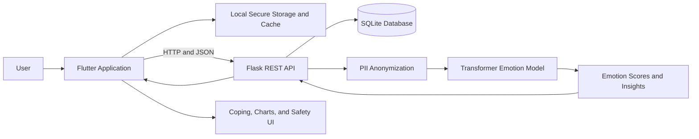

# Nuromood

### AI-Powered Emotion Journal and Mental Wellness Application

Nuromood is a cross-platform emotion journaling and mental wellness application developed as a **BSc (Hons) Software Engineering Final Year Project**. It allows users to record private journal entries, identify emotions using a fine-tuned transformer model, monitor mood patterns, receive coping suggestions, and access crisis-support prompts when potentially harmful language is detected.

The system combines a Flutter client, a Python Flask REST API, SQLite persistence, and a Hugging Face Transformers-based text classification model.

[Open the interactive web demo](https://shanakarajapakshe.github.io/NuroMood---AI-based-Mental-Health-Monitoring-App/)

The GitHub Pages demo runs entirely in the browser with sample data and local storage. It does not send journal text to the Flask API or the trained model.

> **Medical disclaimer:** Nuromood is a supportive self-reflection and wellness tool. It is not a medical device, does not diagnose mental health conditions, and must not replace qualified professional care or emergency services.

## Table of Contents

- [Project Overview](#project-overview)
- [Problem Statement](#problem-statement)
- [Aim and Objectives](#aim-and-objectives)
- [Core Features](#core-features)
- [System Architecture](#system-architecture)
- [Technology Stack](#technology-stack)
- [AI and Emotion Analysis](#ai-and-emotion-analysis)
- [Privacy, Security, and Safety](#privacy-security-and-safety)
- [Project Structure](#project-structure)
- [Getting Started](#getting-started)
- [API Reference](#api-reference)
- [Model Training and Inference](#model-training-and-inference)
- [Testing and Quality Checks](#testing-and-quality-checks)
- [Building for Release](#building-for-release)
- [Limitations](#limitations)
- [Future Improvements](#future-improvements)
- [Ethical Considerations](#ethical-considerations)
- [License and Academic Use](#license-and-academic-use)

## Project Overview

Digital journaling can help people reflect on daily experiences, but traditional journal applications usually store text without converting it into useful emotional insights. Nuromood addresses this gap by combining private journaling with Natural Language Processing (NLP), mood visualization, personalized coping activities, and safety-aware interactions.

The application supports web and mobile interfaces through Flutter. A Flask backend manages authentication, journal records, emotion analysis, insights, gamification, subscriptions, exports, and crisis-event logging.

## Problem Statement

People may find it difficult to recognize gradual changes in their emotional well-being from isolated journal entries. Existing journaling tools often provide limited automated analysis, while general-purpose sentiment systems may oversimplify emotions into positive and negative labels.

Nuromood investigates how a software system can:

- classify multiple emotions from journal text;
- present understandable mood trends and triggers;
- protect sensitive journal information;
- encourage regular self-reflection; and
- respond responsibly when potentially high-risk language is detected.

## Aim and Objectives

### Aim

To design and implement a secure, AI-assisted journaling application that helps users understand emotional patterns and supports healthy self-reflection.

### Objectives

1. Develop a responsive cross-platform journaling client using Flutter.
2. Implement secure user registration and authentication.
3. Create, edit, retrieve, restore, and delete journal entries.
4. Train and integrate a transformer-based multi-class emotion classifier.
5. Display confidence scores, mood history, trends, triggers, and sentiment shifts.
6. Provide emotion-aware coping exercises and wellness guidance.
7. Detect predefined crisis signals and display an appropriate support interface.
8. Apply privacy controls such as password hashing, PII anonymization, secure key storage, and encrypted journal payload support.
9. Encourage engagement through streaks, badges, and reminders.
10. Evaluate the system through model, API, and Flutter quality checks.

## Core Features

### Account Management

- Email and password registration.
- Password hashing with Werkzeug.
- User login and local session persistence.
- Optional biometric access control on supported devices.
- Free and premium entitlement handling.

### Journal Management

- Create and edit journal entries.
- View all active entries or entries from a selected date.
- Attach an optional image path.
- Move entries to Trash using soft deletion.
- Restore or permanently delete trashed entries.
- Automatically purge entries that remain in Trash for more than 30 days.
- Support encrypted journal payloads and encryption metadata.

### AI Emotion Analysis

- Transformer-based journal text classification.
- Primary emotion and confidence score.
- Full emotion probability distribution.
- Top-emotion summary.
- Hybrid normalization using model predictions and language cues.
- PII anonymization before model inference.
- Basic Sinhala transliterated emotion keywords in addition to English cues.

The application can return the following user-facing categories:

- anger
- anxiety
- fear
- joy
- love
- neutral
- sadness
- surprise

### Insights and Visualization

- Mood calendar.
- Mood trend charts.
- Seven-day and 30-day chart tiers.
- Trigger categories for work, relationships, health, and finance.
- Sentiment-shift detection across sections of an entry.
- Recent AI insight summaries.
- Advanced dashboard with exports and gamification data.

### Coping and Safety Support

- Emotion-specific breathing, grounding, self-care, savoring, and connection exercises.
- Crisis-term and high-confidence negative-emotion checks.
- Crisis support overlay in the Flutter client.
- Logging of crisis-support interactions.

The crisis detector is a precautionary keyword/rule-based feature. It is not a clinical risk assessment.

### Engagement

- Current and longest journaling streaks.
- Preferred reminder time based on usage patterns.
- Local daily notifications.
- Achievement badges:
  - First Reflection
  - 7-Day Rhythm
  - 30-Day Commitment
  - Positive Flow
  - Deep Reflector

### Media and Export

- Voice journaling using speech-to-text.
- Image selection for journal entries.
- Clinical JSON export that excludes raw journal body text.
- PDF and JSON generation from the Flutter dashboard.
- File sharing and printing support.

## System Architecture



### Main Data Flow

1. The user writes a journal entry in the Flutter application.
2. Sensitive patterns are anonymized before model inference.
3. The backend tokenizes the text and runs the trained emotion classifier.
4. Model probabilities are combined with configured linguistic cues.
5. The backend derives the primary emotion, confidence, triggers, sentiment shifts, coping content, and crisis flag.
6. Journal and analysis metadata are stored in SQLite.
7. The Flutter client presents the result through journal cards, charts, dashboards, and support interfaces.

## Technology Stack

| Layer | Technologies |
| --- | --- |
| Client | Flutter, Dart, Material 3 |
| API | Python, Flask, Flask-CORS |
| Database | SQLite |
| AI/ML | PyTorch, Hugging Face Transformers, DistilBERT |
| Security | Werkzeug password hashing, Flutter Secure Storage, AES support |
| Local storage | Shared Preferences, SQLite, Hive |
| Charts and reports | fl_chart, pdf, printing, share_plus |
| Device features | local_auth, image_picker, speech_to_text, local notifications |

### Main Flutter Packages

`http`, `shared_preferences`, `local_auth`, `flutter_secure_storage`, `encrypt`, `connectivity_plus`, `image_picker`, `speech_to_text`, `flutter_local_notifications`, `timezone`, `fl_chart`, `pdf`, `printing`, `share_plus`, `sqflite`, `sqflite_common_ffi`, `sqflite_sqlcipher`, `hive`, and `hive_flutter`.

## AI and Emotion Analysis

### Model

The training configuration uses `distilbert-base-uncased` with a maximum sequence length of 160 tokens. Training data is read from CSV files in `data/`, and the trained model, tokenizer, configuration, and label metadata are stored in `artifacts/`.

The configured training labels are:

```text
anger, fear, joy, love, sadness, surprise
```

At runtime, Nuromood extends the model output with anxiety and neutral handling through application-level normalization and emotion-language evidence.

### Training Configuration

The default values in `config.json` are:

| Setting | Value |
| --- | --- |
| Base model | `distilbert-base-uncased` |
| Maximum length | 160 |
| Epochs | 3 |
| Batch size | 16 |
| Learning rate | 0.00005 |
| Weight decay | 0.01 |
| Warm-up ratio | 0.1 |
| Random seed | 42 |

### Baseline

The `baseline/` directory contains a TF-IDF and Logistic Regression implementation. It can be used as a conventional machine-learning baseline when comparing the transformer model's performance.

## Privacy, Security, and Safety

Nuromood processes highly sensitive personal text. The current implementation includes:

- password hashing rather than plain-text password verification for new credentials;
- email, phone-number, and ID-like pattern anonymization before AI inference;
- encrypted journal payload fields and encryption metadata;
- AES-based client encryption support;
- secure key/value storage through `flutter_secure_storage`;
- optional biometric access control;
- soft deletion and automatic Trash retention rules;
- clinical exports that omit raw journal text; and
- crisis interaction logging for safety-feature evaluation.

### Production Security Notes

The repository is an academic prototype. Before a public deployment:

- disable Flask debug mode;
- serve all traffic over HTTPS;
- replace unrestricted CORS with an explicit origin allow-list;
- move secrets and configuration into environment variables;
- use token-based authentication and authorization on every protected endpoint;
- validate ownership of all user resources;
- encrypt sensitive server-side data at rest;
- apply rate limiting, audit logging, and secure backup policies;
- obtain an independent security and privacy review; and
- complete a clinical and ethical review before presenting safety features as health interventions.

## Project Structure

```text
.
|-- app.py                         # Main Flask and SQLite backend
|-- backend/
|   `-- fastapi_app.py             # Experimental FastAPI/PostgreSQL backend
|-- mobile_web/                    # Main Flutter application
|   |-- lib/
|   |   |-- main.dart
|   |   |-- login_page.dart
|   |   |-- register_page.dart
|   |   |-- journal_home.dart
|   |   |-- add_journal_page.dart
|   |   |-- guides_page.dart
|   |   |-- db_helper.dart
|   |   |-- models/
|   |   |-- screens/
|   |   |-- services/
|   |   |-- theme/
|   |   `-- widgets/
|   |-- assets/
|   |-- test/
|   `-- pubspec.yaml
|-- artifacts/                     # Trained model and tokenizer files
|-- baseline/                      # TF-IDF/Logistic Regression baseline
|-- data/                          # Train, validation, and test CSV files
|-- database/
|   `-- nuromood.db                # Local SQLite database
|-- migrations/                    # Database migration experiments
|-- templates/                     # Flask templates
|-- uploads/                       # Local uploaded media
|-- config.json                    # ML training configuration
|-- train.py                       # Transformer training script
|-- infer.py                       # Command-line inference utility
|-- utils.py                       # Dataset and label utilities
`-- run_backend_with_venv.py       # Backend startup helper
```

## Getting Started

### Prerequisites

Install the following tools:

- Python 3.10 or later
- Flutter SDK with Dart 3
- Chrome for Flutter web development
- Android Studio and an Android SDK for Android development
- Git, if the project is being cloned from a repository

Confirm the installations:

```powershell
python --version
flutter --version
flutter doctor
```

### 1. Open the Project

```powershell
cd "<path-to-nuromood-project>"
```

### 2. Configure the Python Backend

Create and activate a virtual environment:

```powershell
py -m venv .venv
.\.venv\Scripts\Activate.ps1
```

Install the required packages:

```powershell
python -m pip install --upgrade pip
pip install flask flask-cors torch transformers werkzeug pandas numpy tqdm scikit-learn
```

Ensure these resources exist before starting the API:

```text
artifacts/config.json
artifacts/label_names.json
artifacts/model.safetensors
artifacts/tokenizer.json
database/
```

Start the Flask API from the project root:

```powershell
python app.py
```

The development server will be available at:

```text
http://127.0.0.1:5000
```

The backend initializes missing SQLite tables and columns when it starts.

### 3. Configure the Flutter Client

Open a second terminal:

```powershell
cd mobile_web
flutter pub get
```

Run the web application:

```powershell
flutter run -d chrome
```

### API Address for Different Targets

The current client source uses:

```text
http://127.0.0.1:5000
```

This works when the browser or desktop client can reach the backend on the same computer. For other targets, update `apiBase` in the relevant Flutter service files:

| Target | Typical development URL |
| --- | --- |
| Flutter Web/Windows on same PC | `http://127.0.0.1:5000` |
| Android emulator | `http://10.0.2.2:5000` |
| Physical phone on same network | `http://<computer-lan-ip>:5000` |
| Production | `https://<deployed-api-domain>` |

Relevant files include:

```text
mobile_web/lib/db_helper.dart
mobile_web/lib/add_journal_page.dart
mobile_web/lib/services/entitlement_service.dart
mobile_web/lib/services/journal_api_service.dart
```

For Android development with an HTTP API, the Android network security configuration may also need to permit clear-text local traffic. Production traffic should use HTTPS.

## API Reference

Base URL:

```text
http://127.0.0.1:5000
```

### Authentication

| Method | Endpoint | Purpose |
| --- | --- | --- |
| `POST` | `/register` | Register a user |
| `POST` | `/login` | Authenticate a user |

### Entitlements

| Method | Endpoint | Purpose |
| --- | --- | --- |
| `GET` | `/entitlements/<user_id>` | Read the user's tier and enabled features |
| `POST` | `/entitlements/<user_id>` | Update free or premium status |

### Journals

| Method | Endpoint | Purpose |
| --- | --- | --- |
| `GET` | `/journals/<user_id>` | List active journal entries |
| `POST` | `/journals/<user_id>` | Create a journal entry |
| `PUT` | `/journals/<user_id>/<journal_id>` | Update a journal entry |
| `DELETE` | `/journals/<user_id>/<journal_id>` | Move an entry to Trash |
| `GET` | `/journals/<user_id>/trash` | List trashed entries |
| `POST` | `/journals/<user_id>/<journal_id>/restore` | Restore a trashed entry |
| `DELETE` | `/journals/<user_id>/<journal_id>/permanent` | Permanently delete an entry |
| `GET` | `/journals/<user_id>/date/<date>` | List entries for a date |

The date route expects `YYYY-MM-DD`.

### AI Analysis

| Method | Endpoint | Purpose |
| --- | --- | --- |
| `POST` | `/analyze_text` | Analyze text without creating a journal |
| `POST` | `/analyze-journal` | Analyze and save a journal payload |

Example request:

```powershell
Invoke-RestMethod `
  -Method Post `
  -Uri "http://127.0.0.1:5000/analyze_text" `
  -ContentType "application/json" `
  -Body '{"text":"I feel calm and grateful today."}'
```

The response includes the primary emotion, confidence, confidence percentage, score distribution, top emotions, triggers, sentiment-shift data, crisis status, and a coping plan.

### Gamification, Safety, and Export

| Method | Endpoint | Purpose |
| --- | --- | --- |
| `GET` | `/gamification/<user_id>` | Read streak and badge information |
| `POST` | `/crisis-events` | Log a crisis-support interaction |
| `GET` | `/exports/<user_id>/clinical.json` | Generate a clinical-style JSON export |

## Model Training and Inference

### Dataset Format

The default configuration expects:

```text
data/train.csv
data/val.csv
data/test.csv
```

The CSV files use `text` as the input column and `label` as the target column.

### Train the Transformer Model

From the project root with the virtual environment active:

```powershell
python train.py --config config.json
```

The training script saves the model and tokenizer under `artifacts/nuromood_model/`. Check the output path before replacing the model files used directly by `app.py`, which currently loads from `artifacts/`.

### Run Command-Line Inference

```powershell
python infer.py --text "I feel hopeful about tomorrow."
```

The inference utility loads the model from `artifacts/`. Use `python infer.py --help` to inspect the available arguments.

### Run the Baseline

```powershell
cd baseline
python tfidf_logreg.py
cd ..
```

Baseline results and serialized estimators are stored in `baseline/results/`.

## Testing and Quality Checks

Run the following checks before submitting or releasing the project.

### Flutter Analysis and Tests

```powershell
cd mobile_web
flutter analyze
flutter test
```

### Backend Syntax Check

From the project root:

```powershell
python -m py_compile app.py train.py infer.py utils.py
```

### Manual Integration Test

1. Start the Flask backend.
2. Start the Flutter application.
3. Register a test account and log in.
4. Create a journal entry and verify the emotion result.
5. Edit, delete, restore, and permanently delete a test entry.
6. Verify mood charts, streaks, badges, coping content, and export behavior.
7. Test crisis-support UI only with controlled non-personal test data.
8. Confirm that no raw journal body appears in the clinical export.

### Recommended Research Evaluation

For the final project report, evaluate the classifier on the held-out test set using:

- accuracy;
- macro and weighted precision;
- macro and weighted recall;
- macro and weighted F1-score;
- confusion matrix;
- per-class performance; and
- comparison with the TF-IDF/Logistic Regression baseline.

Report dataset balance, preprocessing, hardware, random seed, model version, and known sources of bias so the results can be reproduced.

## Building for Release

### Flutter Web

```powershell
cd mobile_web
flutter build web
```

Output:

```text
mobile_web/build/web/
```

Preview the production build:

```powershell
cd build/web
python -m http.server 8088 --bind 127.0.0.1
```

Open `http://127.0.0.1:8088`.

### Android APK

```powershell
cd mobile_web
flutter build apk --release
```

Output:

```text
mobile_web/build/app/outputs/flutter-apk/app-release.apk
```

### Deployment

The Flutter web output can be hosted on a static hosting provider. The backend requires a Python hosting environment and persistent database/storage configuration.

Before deployment, update all client API URLs, use HTTPS, disable debug mode, configure restricted CORS, and avoid committing production databases, secrets, personal journal data, or uploaded user media.

## Limitations

- Emotion predictions can be inaccurate, especially for sarcasm, mixed emotions, slang, code-switching, and short text.
- Sinhala support is limited to selected transliterated keywords rather than a fully trained multilingual model.
- Anxiety and neutral are derived partly through application-level rules rather than being original training labels.
- Keyword-based trigger and crisis detection can produce false positives and false negatives.
- The SQLite backend is suitable for local development and prototype evaluation, not high-scale concurrent production use.
- Authentication and authorization require further hardening for public deployment.
- Voice, biometric, notification, and secure-storage behavior differs by platform.
- The repository does not currently provide a complete automated backend test suite or documented clinical validation.

## Future Improvements

- Train and evaluate a multilingual model for English, Sinhala, Tamil, and code-switched text.
- Add explainable AI features that communicate why an emotion was suggested.
- Introduce refresh tokens, role-based authorization, rate limiting, and account recovery.
- Replace hard-coded API addresses with environment-based configuration.
- Add comprehensive unit, widget, API integration, security, and end-to-end tests.
- Conduct usability studies with representative users.
- Validate coping and crisis-support content with qualified mental-health professionals.
- Add consent management, data download, account deletion, and configurable retention.
- Move production persistence to PostgreSQL and object storage.
- Add CI/CD for automated analysis, tests, model evaluation, and release builds.
- Compare transformer and baseline models using documented experimental results.

## Ethical Considerations

Mental wellness software must avoid presenting uncertain model outputs as facts. Nuromood should:

- describe predictions as suggestions rather than diagnoses;
- display confidence and uncertainty clearly;
- obtain informed consent before processing sensitive text;
- collect only the minimum necessary data;
- allow users to delete and export their information;
- avoid manipulative premium restrictions around essential safety support;
- provide region-appropriate crisis resources; and
- use human and professional review for any future clinical claims.

Training and test datasets should be reviewed for class imbalance, demographic bias, harmful content, licensing restrictions, and privacy risks.

## License and Academic Use

This repository was created for a BSc (Hons) Software Engineering final-year project. Unless a separate license file is added, the source code should be treated as **all rights reserved** and should not be redistributed or reused without the author's permission.

When presenting or publishing results, cite the datasets, pretrained model, libraries, and external resources used by the project according to their respective licenses and academic requirements.

---

**Project:** Nuromood<br>
**Category:** Artificial Intelligence, Natural Language Processing, Mobile/Web Application, Mental Wellness<br>
**Academic Context:** BSc (Hons) Software Engineering Final Year Project
